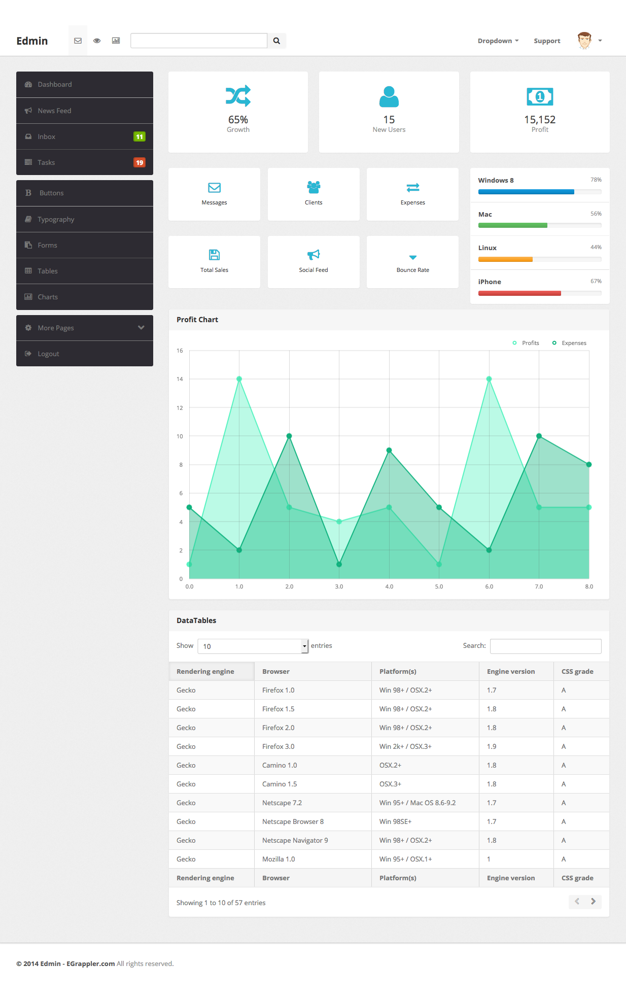

# Study repository to learn frontend implementation

## [Edmin](https://www.egrappler.com/edmin/index.html)

トップレベルは次の 3 構成。

- header (`.navbar`)
- main (`.wrapper`)
- footer (`.footer`)

## Terms

- [http-equiv](https://developer.mozilla.org/en-US/docs/Web/HTML/Element/meta#attr-http-equiv)
    - Configure HTTP related value.  
    `content-type` attribute is not recommended anymore, as it is oblsolete. Using `charset` for character setting is recommended.
- [viewport](https://developer.mozilla.org/en-US/docs/Web/HTML/Element/meta#attr-name)
